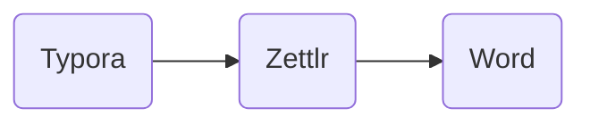

# So only headline 1 has horizontal divider?

## headline2 also has divider

### headline 3 doesn't have divider

#### Is there headline 4? The answer is yes!

This is interesting!

> Would want to include a quoute here.

How about adding a `script`

I decided that **Pixyll** is a good theme[@lorentPlasmaMembranesAre2020].

H~2~O

WDR5^l/l^

==highlighting== also works! [@violetaAgeDependentNicheSignals2016]

#### can you follow text after after heading?

**I guess not**. The way to go is probably just to bold the beginning of the paragraph [@leventalLipidomicBiophysicalHomeostasis2020]

Figureing out how to use git checkout -commit 1 [@owenFluorescenceLifetimeImaging2006]

Now I wan to add another version - commit 2[@holcapekLipidomicAnalysis2018]

Is this a page break?

Yet another change - commit 3 and this is what a [link](www.xiaoaizhao.com) looks like.

How does table of content work?

[toc]

This is interesting! it shows all the levels of headlines and is in sync when changed.

Try mermaid chart

<!--how does comment look like after export to docx-->

## References
